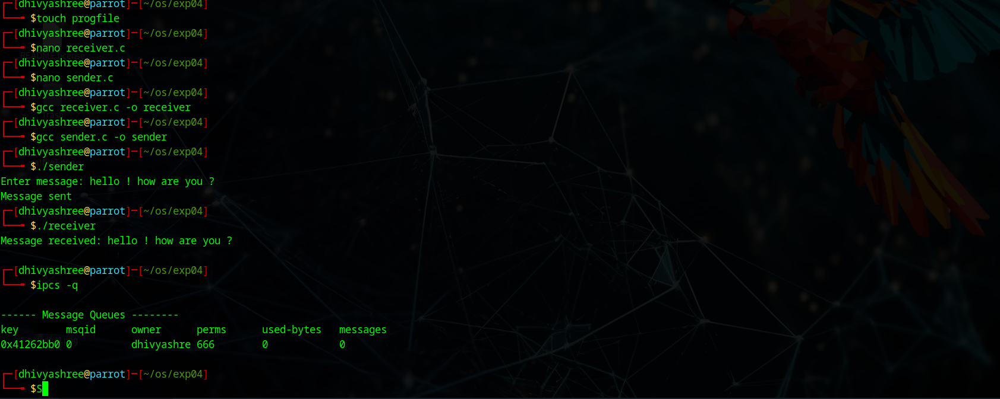

# Linux-IPC-Message-Queues
Linux IPC-Message Queues

# AIM:
To write a C program that receives a message from message queue and display them

# DESIGN STEPS:

### Step 1:

Navigate to any Linux environment installed on the system or installed inside a virtual environment like virtual box/vmware or online linux JSLinux (https://bellard.org/jslinux/vm.html?url=alpine-x86.cfg&mem=192) or docker.

### Step 2:

Write the C Program using Linux message queues API 

### Step 3:

Execute the C Program for the desired output. 

# PROGRAM:

## C program that receives a message from message queue and display them
sender 
```
#include <stdio.h>
#include <string.h>
#include <sys/ipc.h>
#include <sys/msg.h>

struct msg_buffer {
    long msg_type;
    char msg_text[100];
};

int main() {
    key_t key;
    int msgid;
    struct msg_buffer message;

    // Generate unique key
    key = ftok("progfile", 65);

    // Create message queue
    msgid = msgget(key, 0666 | IPC_CREAT);

    message.msg_type = 1;

    printf("Enter message: ");
    fgets(message.msg_text, sizeof(message.msg_text), stdin);

    // Send message
    msgsnd(msgid, &message, sizeof(message.msg_text), 0);

    printf("Message sent\n");

    return 0;
}
```
receiver:
```
#include <stdio.h>
#include <sys/ipc.h>
#include <sys/msg.h>

struct msg_buffer {
    long msg_type;
    char msg_text[100];
};

int main() {
    key_t key;
    int msgid;
    struct msg_buffer message;

    // Generate unique key
    key = ftok("progfile", 65);

    // Access message queue
    msgid = msgget(key, 0666 | IPC_CREAT);

    // Receive message
    msgrcv(msgid, &message, sizeof(message.msg_text), 1, 0);

    // Display message
    printf("Message received: %s\n", message.msg_text);

    // Destroy message queue
    msgctl(msgid, IPC_RMID, NULL);

    return 0;
}
```


## OUTPUT




# RESULT:
The programs are executed successfully.
